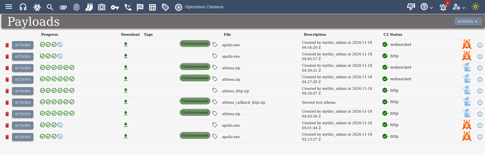
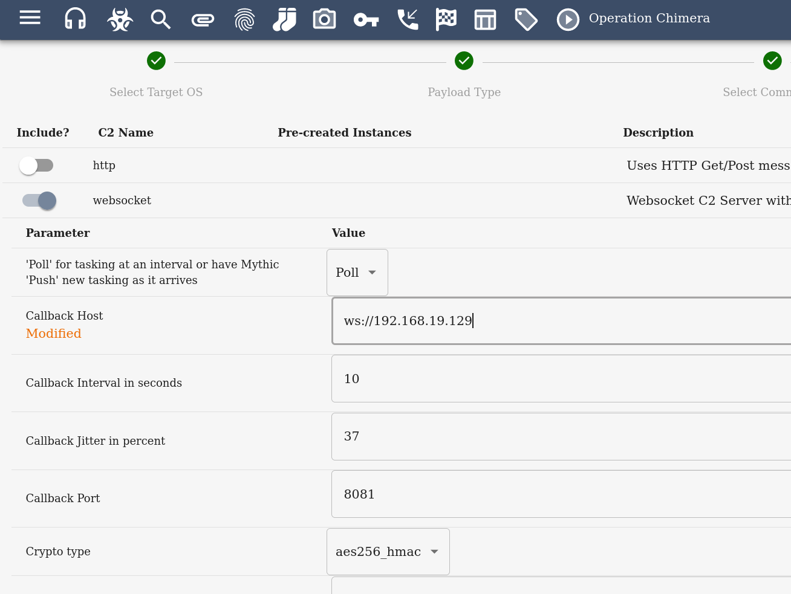

## Mythic C2 

### Installation

- First you will need to clone Mythic from Github. `git clone https://github.com/its-a-feature/Mythic`
- If you do not have Docker installed. You will need to install it. I recommend that you use the script provided(`./install-docker-kali.sh`); however, if you can't (or if it doesn't work) follow these steps:
    - Follow the steps on [Docker's Official Website](https://docs.docker.com/engine/install/debian/)
    - `sudo apt install docker.io`
    - `sudo apt install docker-compose`
    - `sudo apt install docker-compose-plugin`
- Next you need to make the CLI binary. To do this, run `sudo make`
- You are going to want to start the Mythic C2 Framework. To do this, run the command `sudo ./mythic-cli start`
    - This is going to give you a C2 framework with no agents or listeners. Mythic has many of these (and you can even create your own)! We are going to use Apollo and Websockets. 
    - To intall both, run the following commands:
        - `sudo ./mythic-cli install github https://github.com/MythicAgents/Apollo.git`
        - `sudo ./mythic-cli install github https://github.com/MythicC2Profiles/websocket.git`
    -  These commands can be run when mythic is running

### Using Mythic

Mythic is a complex C2 Framework that and has many features. For this exercise we are going to focus on getting you up and running with the framework!

- Look inside the `/path/to/Mythic/.env` file. There you will see a ADMIN_USER and ADMIN_PASSWORD like this:  
- Next you are going to log in. By default, the url to get to the Myhic login is at `https://localhost:7443`
- This will take you to the login screen. There is a lot that you can do from here. Some of the important things include:
    - Operations - defines the campaign you are working
    - Payloads - Generate binaries to deploy to target
    - Callbacks - Interactions with the C2. 
    - Artifacts - Shows what was left on disk. Great for managing what needs to be done. 

What we are oging to focus on is creating a payload and interacting with it. For this, we are going to try to generate a payload to launch onto our `Metasploitable 3 VM`

Let's navigate over towards **payloads**. It is going to look like this, but no payloads generated. 

- We are going to want to click on `Actions` on the top right. We are then going to generate a new payload. 
- We are going to select `Windows` as the platform. Click Next
- We are going to select `Apollo`. We can generate our payload in multiple different formats (including executable, shellcode, etc.). For this, we are going to keep it simple, we are going to want to have it be an executable. Everything else should be defaults. You can make debug builds but that is for another time. Click Next
- Add/remove commands. You can load more commands in later, but these will be the defaults. Note: more you add in the bigger it gets. Right hand side is what is part of the executable. 
- We are then going to configure our WebSocket as our communication stream. For this, we are going to set it to the IP of our Kali (because that's wehre we want our agent polling to). The defaults are good enough for this exercise. We may want to in the future change the web sockets from port 8081 to hide ourselves better. After you are done, click next.  
- Now we can create payload! We will then download it. 
- After downloading, we will need to get the payload over to the Metasploitable 3 VM. Normally this will be done via an exploit, but for simplicity, I am just going to do it via `python3 -m http.server <port>`. 
    - After transferring, execute your payload on the Metasploitable 3 VM. 
- We will then navigate over to Callbacks. At this point you will start to see your agent is polling to your Mythic C2. You can start interacting with it! Have fun!